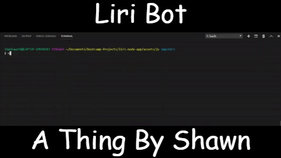

# liri-node-app

### What is the '*LIRI Bot*'?
Liri is a **command line (CLI) application** (and parody of Siri) that allows you to 
search for your favorite movies, songs, and even checks where your favorite band 
or artist is touring and when. Liri makes it easy to get the information you 
need, whenever you need it.

### Brief Technical Overview:
1. Liri is a command line application that uses 6 required node packages to run:
   * dotenv
   * spotify
   * axios
   * fs
   * moment

2. It uses JavaScript switch cases to determine if an API is valid or invalid, defaulting to a welcome message with a command list.
3. Commands are logged into 'log.txt'.

It's really that simple, but it allows you to grab so much data very quickly from many great data sources.

### Detailed Technical Overview:

#### Node.JS & APIs
Liri is a node application that requires several API's, including all of the following node packages:

* **node-spotify-api:**
  * A library for the Spotify REST API.
* **bandsintown:**
  * An API to find tour dates and live music for all your favorite bands.
* **axios:**
  * A promise based HTTP client for the browser and node.js.
* **file-system:**
  * A simplified file system to (read, write, and log) events more easily.
* **moment:**
  * A lightweight JavaScript date library for parsing, validating, manipulating, and formatting dates.
* **dotenv:**
  * Dotenv is a zero-dependency module that loads environment variables from a .env file into process.env. Storing configuration in the environment separate from code is based on The Twelve-Factor App methodology.

#### NPM Packages:
https://www.npmjs.com/package/node-spotify-api  
https://www.npmjs.com/package/bandsintown  
https://www.npmjs.com/package/axios  
https://www.npmjs.com/package/file-system  
https://www.npmjs.com/package/moment  
https://www.npmjs.com/package/dotenv

#### LIRI Command Line Arguments

Since LIRI is a command line application, it takes in two arguments to send a server data request from an API:

* **(API-Name):**
  * This first argument checks for a valid API request from the user. A good example of this is the LIRI command 'spotify-this'.
* **(Data-Request):**
  * This second argument is the data the user wants to send to a server in response for data, such as if the user wanted to find the song 'I want it that way' by Justin Timberlake from the 'spotify-this' command.

#### Switch Cases
Liri uses switches as a method of determining valid API requests from command line arguments. 
If the command the user is attempting to enter is a valid one, it will push the users data 
to that API for a response from the server. If the argument is invalid, LIRI defaults to 
a welcome message with a list of suggested commands and tips for the user to try out and 
reference anytime they so desire.

#### History Log
Once the switch determines the command is valid and API data is returned, your command is logged to a file called 'log.txt'.

## How to Run LIRI
Liri is a command line application, so you can use any of the following CLI's to run it:

* Git Bash
* Terminal
* Command Prompt
* And any CLI that can run Node JavaScript apps

#### Assuming You Have Nothing Installed
1. Clone 'liri-node-app' from the repository to anywhere on your machine.
2. Install node.js (GO HERE: https://nodejs.org/en/).
3. Open VS Code or your CLI of choice and run the command :'npm install'.
4. When your package is done installaing, cd to 'assets\js'.
5. Execute liri.js by entering the command: 'node liri'.
6. Finally, you should get a welcome message with a list of commands!

#### Assuming You Have Everything Installed
1. Clone 'liri-node-app' from the repository to anywhere on your machine.
2. Open VS Code or your CLI of choice and cd to 'assets\js'.
3. Execute liri.js by entering the command: 'node liri'.
4. Finally, you should get a welcome message with a list of commands!

At this time, an installation guide is not present, as Liri is still a work in progress. More documentation coming very soon!

## LIRI Bot Presentation Video
COMING SOON!